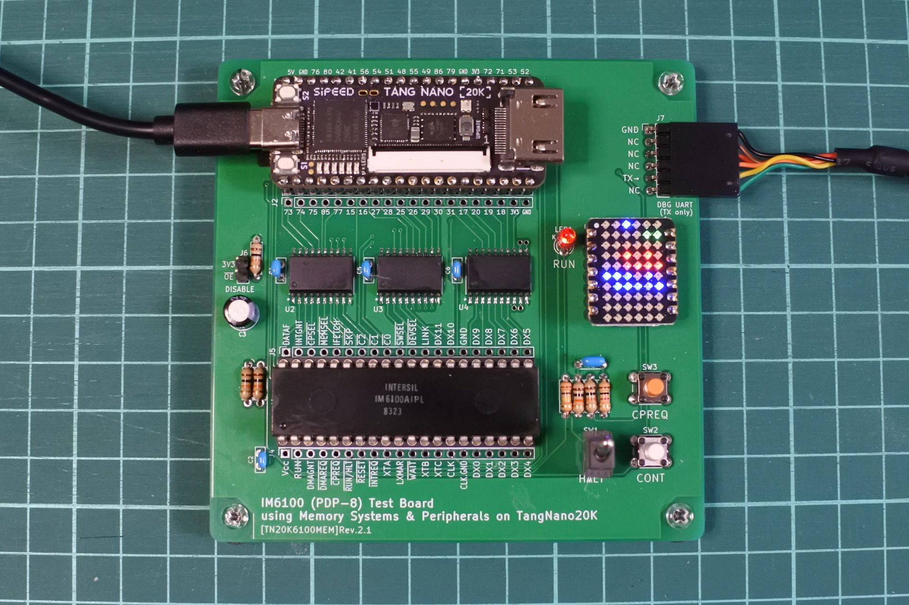

# 基板 rev.2.1

#### BOM
|Reference          |Value| Qty  |Memo |
|-------------------|-----|------|-----|
|C1|1uF|1|||
|C2,C4,C5,C6|0.1uF|4||
|C3|47uF|1|||
|J1|01x20 pin socket|2|TangNano20K用|
|J2,J3,J4,J5|01x20 pin socket or header|4||実験用．無くても可．|
|J6|01x2 pin header|1|無くても可．|
|J7|01x6 pin header(L字)|1|デバッグUART用|
|LED1|LED|1| If=50μAぐらいで点灯するもの|
|R1,R2,R4,R5,R7|10k|5||
|R3|47k|1||
|R6|1k|1||
|SW1|トグルSW|1||
|SW2, SW3|タクトSW|1||
|U1|IM6100A|1|40P DIP 600mil socket|
|U2,U3,U4|SN74CB3T3245DWR(DWでも可)|3|SOIC-20．サイズに注意|
|U5|WS2812B 6x10 matrix|1|Seeed Studio XIAO用 6×10 RGBマトリクス|

#### パーツに関する補足や注意事項
- SN74CB3T3245はパッケージサイズに注意．SOIC-20はDWかDWRです．PWやPWRではありません．
- LEDは47KΩつけたけでCPUに直結しています．If=70μAぐらいで点灯するLEDを使って下さい．とりあえず，下記が使えることを確認しました．
  - OSR5PA3133A-1MA https://akizukidenshi.com/catalog/g/g116908/ 最初これを使っていたのですが販売終了でした．
  - OSR5JA3Z74A https://akizukidenshi.com/catalog/g/g111577/
  - OSR5JA7WA1B https://akizukidenshi.com/catalog/g/g114260/

#### 主なパーツの入手先
|parts              |store|
|-------------------|-----|
|Tang Nano 20K| 秋月, Sipeed Store(Aliexpress)|
|SN74CB3T3245DWR|マルツ, Mouser, Digikey|
|IM6100A|eBay|
|Seeed Studio XIAO用 6×10 RGBマトリクス|マルツ, Switch Science|
|その他の部品| 秋月, マルツ，共立|

#### レベル変換について
- 信号のインターフェース部分にはバススイッチSN74CB3T3245を使用しています．
  - CPU→FPGAの信号レベルは5Vから3.3Vに変換されます．
  - FPGA→CPUの信号レベルは3.3Vのままです．
- IM6100のデータシートによると，TTL compatibleとあるので3.3Vレベルの信号を入力に使えるはずなのですが，一方でVih=70%*Vcc との記載もあり，若干不安だったのですがとりあえず今の実装で動いているので大丈夫なようです．

