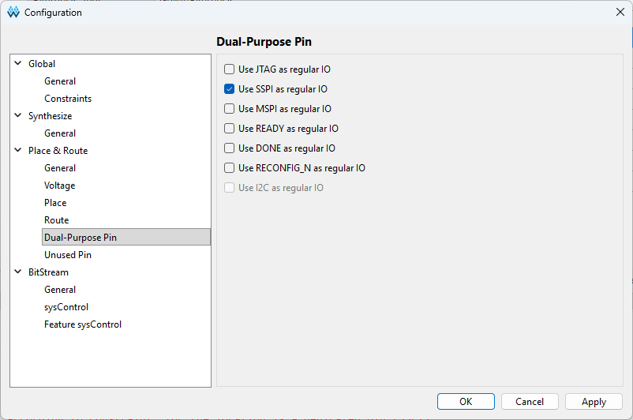
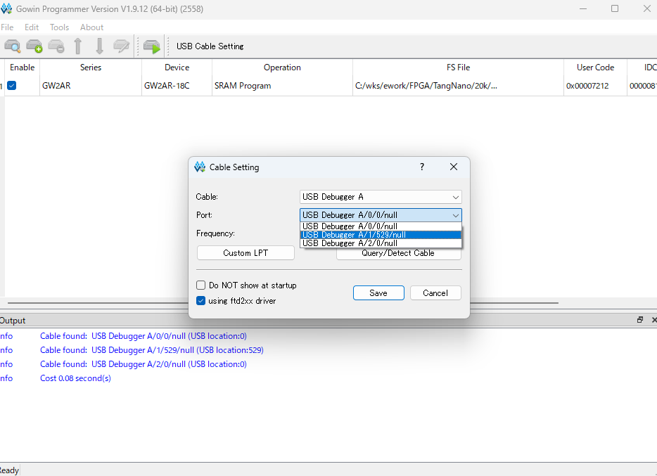

# FPGA関連
## ビルド時の注意点
### Gowin FPGA Designerの設定について
- Configulationはimpl/の*.config.jsonに保存されているようなので，特に何もする必要は無いはずですが，もしエラーが出た場合は、Configuration->Dual-Purpose Pin で"Use SSPI as regular IO"をチェックして下さい．


### warning
- 下記のwarningが出ますが，対処方法がいまいちわからないので放置しています．
```
WARN  (PR1014) : Generic routing resource will be used to clock signal 'sys_clk27_d' by the specified constraint. And then it may lead to the excessive delay or skew
```

### program
- UARTのポートが複数あるので，Gowin programmerでは適切なポートを選択する必要があります．


# FPGAに実装した機能
- TTYコンソール入出力用UART
- 32MW メモリシステム(拡張メモリ)
- 4KW コントロールパネルメモリ
- 割り込み
- RK8E/RK05 ハードディスク (sdメモリによるエミュレーション)
- デバッグ機能(デバッグログ，matrix LED, debug用HALT, CP空間モニタ)

## デバッグ用機能
- 6x10 matrixにいろいろな情報が出力されます．詳細はソースtop.vを参照．
- DBG_UARTに下記の情報が出力されます．詳細はソースtop.vを参照．
  - 一番左は1msタイマーの値．
  - RKディスクアクセス時のコマンド，ディスクアドレス，メモリアドレス等
  - ステップ実行時の命令，アドレス等
- CPREQ ボタンを押すとControl Panel空間でUniversal Monitorが起動します．

## CPUのクロックについて
- CPUのクロックはTangNanoの27MHzのsys_clkを分周して作っています．PLLを使えばもっと細かい値の制御ができますが，IPはなるべく使わない方針なので．
- 分周比が奇数のときはduty比が50%より若干大きくなります．50%にしたら5.4MHzで動かなくなったので，50%にするためのコードはコメントアウトしてます．なので分周比は偶数の方が安全かと思います．
- IM6100AはVcc=10Vで8MHzというスペックのようですが，5Vでも5.4MHzであれば動き，個体によっては6.75MHzで動作するものもありました．ただ，4.5MHzでも時々誤動作することがあったので，余裕をみて3.375MHzにしています．
- もっと速いクロックを試す場合や，6100無印, -1, C等を使う場合には必要に応じてtop.vのCPU_CLK_RATIOを変更して下さい．

